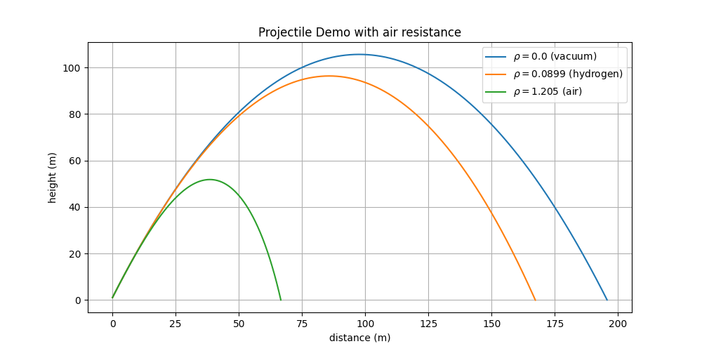

# Projectile Demonstrations:

# Table of Contents
1. [Introduction](#introduction)
2. [The Standard Projectile](#the-standard-projectile)
3. [Projectile given velocity and distance](#projectile-given-velocity-and-distance)
4. [Projectile given target angle and distance](#projectile-given-target-angle-and-distance)
5. [Projectile given max height](#projectile-given-max-height)
6. [Calculating Exit Velocity](#calculating-exit-velocity)
7. [Projectile with air resistance using iterative method](#projectile-with-air-resistance-using-iterative-method)
8. [Projectile with air resistance using ODE scipy method](#projectile-with-air-resistance-using-ODE-scipy-method)
9. [Projectile with air resistance to target](#projectile-with-air-resistance-to-target)

## Introduction

This repository is a collection of demo scripts that analyze various concepts concerning projectiles both with and
without air resistance. To a limited degree, each section discusses the basic mechanics and derivation of each new
concept introduced.

## The Standard Projectile

&space;x&space;-&space;\frac{g}{2V_{0}^2cos(\theta_{i})}x&space;^2)

## Projectile given velocity and distance

The standard projectile equation is used to find the launch angle given a fixed velocity and the distance to the target.
This example contends with a fixed muzzle velocity to adjust the launch angle to achieve the appropriate distance. Note,
however the maximum distance achieved by a fixed velocity launch is at 45 degrees.

<!-- \theta_{i}=tan^{-1} \left(\frac{V_{0}^{2} + \sqrt{V_{0}^{4} - g(g x_{final}^2 + 2(y_{final} - y_{0})V_{0}^{2})}}{g x_{final}}\right) -->
V_{0}^{2})}}{g&space;x_{final}}\right))

## Projectile given target angle and distance

The standard projectile equation is used to find the launch angle and velocity given the target distance and angle. This
example maximizes the angle of attack (AoA) to the target to minimize bounce or to shoot through a hoop.

<!-- \theta_{i} = tan^{-1}\left(\frac{-x_{final}tan(\theta_{final}) - 2(y_{0} + y_{final})}{x_{final}}\right) -->
&space;-&space;2(y_{0}&space;&plus;&space;y_{final})}{x_{final}}\right))

<!-- V_{0}=\frac{1}{cos(\theta_{i})} \sqrt{\frac{g x_{final}}{tan(\theta_{i}) - tan(\theta_{final})}} -->
}&space;\sqrt{\frac{g&space;x_{final}}{tan(\theta_{i})&space;-&space;tan(\theta_{final})}})

## Projectile given max height

The standard projectile equation is used to find the launch angle and velocity given the target distance constrained to
a max ceiling. This example limits the height of the trajectory to avoid a ceiling.

<!-- \theta_{final}=tan^{-1}\left({tan(\theta_{i})-\frac{x_{final}}{2(y_{max}- y_{0})}tan^2(\theta_{i})}\right) -->
-\frac{x_{final}}{2(y_{max}-&space;y_{0})}tan^2(\theta_{i})}\right))

<!-- \theta_{i}=tan^{-1}\left(\frac{2(y_{max}-h) + \sqrt{(y_{max}-y_{0})(y_{max}-y_{final}})}{x_{final}}\right) -->
&space;&plus;&space;\sqrt{(y_{max}-y_{0})(y_{max}-y_{final}})}{x_{final}}\right))

<!-- V_{0}=\frac{1}{cos(\theta_{i})} \sqrt{\frac{g x_{final}}{tan(\theta_{i}) - tan(\theta_{final})}} -->
}&space;\sqrt{\frac{g&space;x_{final}}{tan(\theta_{i})&space;-&space;tan(\theta_{final})}})

## Calculating Exit Velocity

This demo introduces the mass of the projectile, which requires the exit velocity. This example provides an initial pressure of an air cannon. Currently, the model is over-simplified by not accounting for the flow rate of air through the valve connecting the reservoir and barrel. While the gas from a pressurized reservoir expands isothermally, adiabatic model produces a similar result since the temperature drop associated with the adiabatic expansion is so small.

<!-- v_{ab}={\sqrt{\frac{2}{m}\left(\frac{P_{0}V_{0}}{{\gamma} - 1}\left(1 - \left(\frac{V_{0}}{V_{0} + Ax}\right)^{{\gamma} - 1}\right) - xAP_{atm} - xF_{friction}\right)}}  -->
^{{\gamma}%20-%201}\right)%20-%20xAP_{atm}%20-%20xF_{friction}\right)}})

<!-- v_{iso}={\sqrt{\frac{2}{m}\left(P_{0}V_{0}\ln{\left(1+\frac{xA}{V_{0}}\right)} - xAP_{atm} - xF_{friction}\right)}} -->
}%20-%20xAP_{atm}%20-%20xF_{friction}\right)}})

Fow rate is modeled as a function of the pressure differential between the tank pressure and the barrel pressure.

<!-- r\equiv 1-\frac{P_{t}(t)}{P_{b}(t)} -->
}{P_{b}(t)})

<!--
Q=
\left\{
\begin{matrix}
\begin{array}{ll}
 BP(t)C_{v}(1-\frac{r}{3r_{max}})\sqrt{\frac{r}{G_{g}TZ}}, &  P(t)<\frac{P_{b}(t)}{1-r_{max}}\\
 \frac{2}{3}BP(t)C_{v}\sqrt{\frac{r_{max}}{G_{g}TZ}},&  P(t){\ge}\frac{P_{b}(t)}{1-r_{max}}\\
\end{array}
\end{matrix}
\right.
-->
C_{v}(1-\frac{r}{3r_{max}})\sqrt{\frac{r}{G_{g}TZ}},%20&%20%20P(t)%3C\frac{P_{b}(t)}{1-r_{max}}\\\\%20\frac{2}{3}BP(t)C_{v}\sqrt{\frac{r_{max}}{G_{g}TZ}},&%20%20P(t){\ge}\frac{P_{b}(t)}{1-r_{max}}\\\\\end{array}\end{matrix}\right.)

<!--
\begin{matrix}
 B=3.11\times10^{19}\left[\frac{\sqrt{K}}{Pa{\cdot}s}\right],&  G_{g}=1, &T=237[K],& Z\approx 1  \\
\end{matrix}
-->

Gas expansion in the barrel and the tank are modeled using the Ideal Gas Law

<!-- 
\begin{align*}
 P(t)V_{0}&=N_{t}(t)k_{B}T\\
 P(t)V_{0}A(d+x(t))&=N_{b}(t)k_{B}T 
\end{align}
-->
V_{0}&=N_{t}(t)k_{B}T\\\\%20P(t)V_{0}A(d+x(t))&=N_{b}(t)k_{B}T%20\end{align})

The number of molecules in the tank and barrel are governed by the flow fo molecules between them through the valve.

<!-- 
\begin{align*}
 \frac{\mathrm{d} N_{t}}{\mathrm{d} t}&= -Q\\
 \frac{\mathrm{d} N_{t}}{\mathrm{d} t}&= Q
\end{align}
-->

Consequently, the system of differential equations to resolve the exit velocity influenced by valve flow rate is provided below.

<!--
\frac{\mathrm{d}}{\mathrm{d}x}\begin{pmatrix} x\\ v\\ N_{t}\\ N_{b}\end{pmatrix}=\begin{pmatrix}\begin{array}{l} v_{t}\\ \dfrac{A}{m}(P_{t}(t)-P_{b}(t))\\ -Q\\ Q\end{array}\end{pmatrix}
-->
-P_{b}(t))\\\\%20-Q\\\\%20Q\end{array}\end{pmatrix})

    def get_Q(Pt, Pb, rmax):
        # REGIME SELECTION ---------------------------------------------------------------------------------------------
        # the molecular flow rate Q through the valve is a function of the ratio
        r = (Pt - Pb) / Pt
    
        if r <= rmax:
            # non-choked regime
            Q = B * Pt * Cv * (1 - (r / (3 * rmax))) * np.sqrt(r / (Gg * T * Z))
        else:
            # choked regime
            Q = (2 / 3) * B * Pt * Cv * np.sqrt(rmax / (Gg * T * Z))
    
        return Q
    
    
    def deriv(t, u, *args):
        # STATE VARIABLES  ---------------------------------------------------------------------------------------------
        x, v, Nt, Nb = u
    
        # CONSTANTS ----------------------------------------------------------------------------------------------------
        V0, Patm, A, d, m, rmax = args
    
        # FLOW RATE ----------------------------------------------------------------------------------------------------
        Pt = (Nt * K * T) / V0  # Tank Pressure
        Pb = (Nb * K * T) / (A * (d + x))  # Barrel Pressure
        Q = get_Q(Pt, Pb, rmax)
    
        # SYSTEM OF DIFFERENTIAL EQUATIONS -----------------------------------------------------------------------------
        a = A * (Pb - Patm) / m  # acceleration [m/s^2] F = ma --> AP(t) = ma
        dNt = -Q  # Tank Molecules number Differential
        dNb = Q  # Barrel Molecules Number Differential
    
        return v, a, dNt, dNb

    # iterative loop ---------------------------------------------------------------------------------------------------
    while x <= L:
        u = x, v, Nt, Nb

        # ODE loop -----------------------------------------------------------------------------------------------------
        v, a, dNt, dNb = deriv(t, u, V0, Patm, A, d, m, rmax)
        
        # increment state by dt ----------------------------------------------------------------------------------------
        x += v * dt
        v += a * dt

        Nt += dNt * dt
        Nb += dNb * dt

        t += t * dt

## Projectile with air resistance using iterative method

This demo introduces air resistance affecting the trajectory of the projectile. The path is plotted using an iterative loop to solve the ODE system of equations.

<!--
\frac{\mathrm{d}}{\mathrm{d}x}
\begin{pmatrix}
 x\\
 y\\
 V_{x}\\
 V_{y}
\end{pmatrix}
=
\begin{pmatrix}
\begin{array}{l}
 V_{x}\\
 V_{y}\\
 -{\mu}V_{x}\sqrt{V_{x}^2+V_{y}^2}\\
 -{\mu}V_{y}\sqrt{V_{x}^2+V_{y}^2}-g
\end{array}
\end{pmatrix}
=
\begin{pmatrix}
\begin{array}{l}
 V_{x}\\
 V_{y}\\
 -{\mu}V_{x}V_{0}\\
 -{\mu}V_{y}V_{0}-g
\end{array}
\end{pmatrix}
-->

<!--
\begin{matrix}{\mu}=\frac{k}{m}
 &\text{and}&k=\frac{1}{2}C_{d}{\rho}_{air}A\\ 
\end{matrix}
-->

    def deriv(t, u, rho):
        x, y, Vx, Vy = u
        k = 0.5 * Cd * rho * A  # convenience constant
    
        Vxy = np.hypot(Vx, Vy)
        ax = -k / m * Vxy * Vx  # acceleration in x direction
        ay = -k / m * Vxy * Vy - G  # acceleration in y direction
        return Vx, Vy, ax, ay

    def iterative(u0, dt, steps, rho):
        x0, y0, Vx0, Vy0 = u0
    
        x_list = list()
        y_list = list()
        Vx_list = list()
        Vy_list = list()
    
        x_list.append(x0)
        y_list.append(y0)
        Vx_list.append(Vx0)
        Vy_list.append(Vy0)
    
        # Interval of integration by ODE method up to tf -------------------------------------------------------------------
        stop = 0  # stop condition flag to end for loop
        tof = 0  # time of flight
        ttm = 0  # time to max
        last_smallest_Vy = 1e05
    
        # Initial conditions -------------------------------------------------------------------------------------------
        x, y, Vx, Vy = x0, y0, Vx0, Vy0
    
        for t in range(1, steps + 1):
            if stop != 1:
                u = x, y, Vx, Vy
    
                # log data -------------------------------------------------------------------------------------------------
                Vx, Vy, ax, ay = deriv(t, u, rho)
    
                # increment state by dt ------------------------------------------------------------------------------------
                # position
                x += Vx * dt
                y += Vy * dt
    
                # velocity
                Vx += ax * dt
                Vy += ay * dt
    
                t += t * dt
    
                # log data -------------------------------------------------------------------------------------------------
                x_list.append(x)
                y_list.append(y)
    
                Vx_list.append(Vx)
                Vy_list.append(Vy)
    
                # log event - reached highest point why Vy=0 (note: discrete dt step misses 0.0)
                if np.abs(Vy) < last_smallest_Vy:
                    last_smallest_Vy = Vy
                    ttm = t * dt
    
                # stop event - hit target
                if y <= 0.0:
                    tof = t * dt
                    stop = 1
    
        return x_list, y_list, Vx_list, Vy_list, tof, ttm

## Projectile with air resistance using ODE scipy method

This demo improves on the previous section by using the scipy built-in function to solve for the ODE. Events are used to trigger when the projectile has reached its target.

&space;x&space;-&space;\frac{g}{2V_{0}^2cos(\theta_{i})}x&space;^2)

    def deriv(t, u, rho):
        x, y, Vx, Vy = u
        k = 0.5 * Cd * rho * A  # convenience constant
    
        Vxy = np.hypot(Vx, Vy)
        ax = -k / m * Vxy * Vx  # acceleration in x direction
        ay = -k / m * Vxy * Vy - G  # acceleration in y direction
        return Vx, Vy, ax, ay    

    def hit_target(t, u, *args):
        # We've hit the target if the z-coordinate is 0.
        return u[1]
    
    
    def max_height(t, u, *args):
        # The maximum height is obtained when the y-velocity is zero.
        return u[3]

    def run_projectile_resistance_demo(launch_angle, v0, h):
        phi0 = np.radians(launch_angle)
        rho = rho_air

        # Initial conditions
        x0 = 0.
        y0 = h
        Vx0 = v0 * np.cos(phi0)
        Vy0 = v0 * np.sin(phi0)
    
        u0 = x0, y0, Vx0, Vy0
    
        # Interval of integration by ODE method up to tf
        t0 = 0
        tf = (Vy0 + np.sqrt(Vy0**2 + 2*G*h)) / G  # time of flight
        steps = 1000
        dt = tf / steps
    
        # No drag (ND) -------------------------------------------------------------------------------------------------
        X_ND = []
        Y_ND = []
    
        for t in range(steps + 1):
            X_ND.append(x0 + Vx0 * dt * t)
            Y_ND.append(y0 + Vy0 * dt * t - 0.5 * G * (dt * t)**2)
    
        # With drag (WD) -----------------------------------------------------------------------------------------------
        X_WD = []
        Y_WD = []
    
        # Stop the integration when we hit the target.
        hit_target.terminal = True
        # We must be moving downwards (don't stop before we begin moving upwards!)
        hit_target.direction = -1
    
        # scipy.integrate.solve_ivp(func, t_span, y0, args=() ...)
        soln = solve_ivp(deriv, (t0, tf), u0, args=(rho,), dense_output=True, events=(hit_target, max_height))

        # A fine grid of time points from 0 until impact time.
        t = np.linspace(0, soln.t_events[0][0], steps)

        # Retrieve the solution and append
        sol = soln.sol(t)
        X_WD = sol[0]
        Y_WD = sol[2]
    
        # plot the trajectories.
        x = [X_ND, X_WD]
        y = [Y_ND, Y_WD]
    
        plot(x, y)

## Projectile with air resistance to target

This demo brings all the concepts together in order to solve the launch angle of a trajectory for a projectile to reach its target while factoring air resistance. Since a closed form solution does not exist, the secant method is used to algorithmically resolve the roots of the ODE system of equations.

&space;x&space;-&space;\frac{g}{2V_{0}^2cos(\theta_{i})}x&space;^2)
